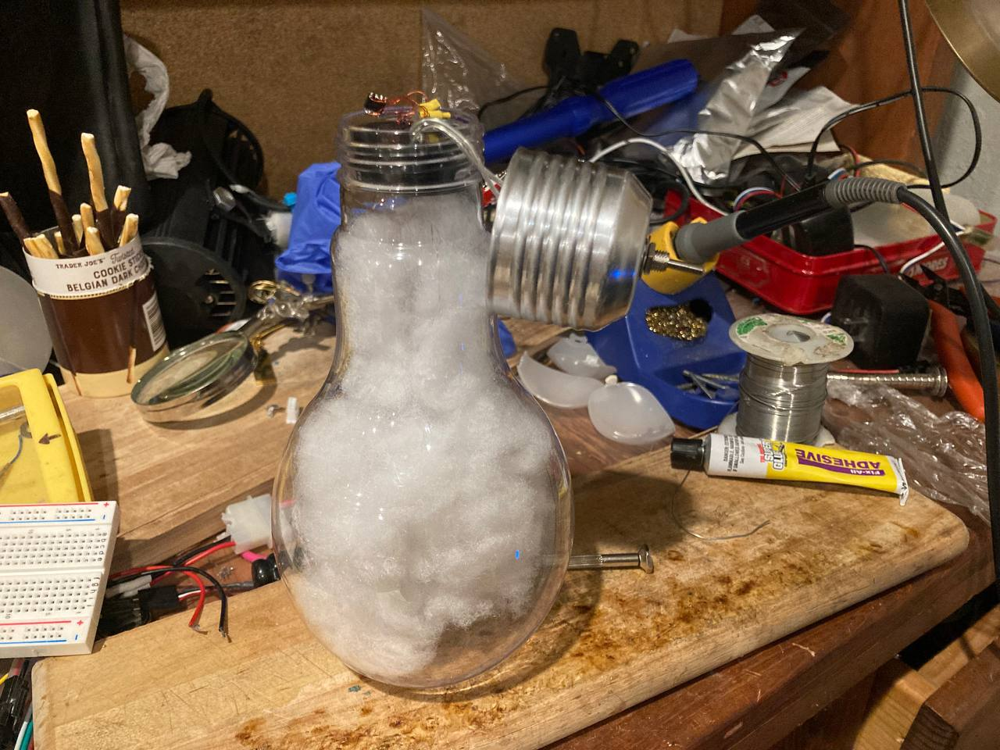
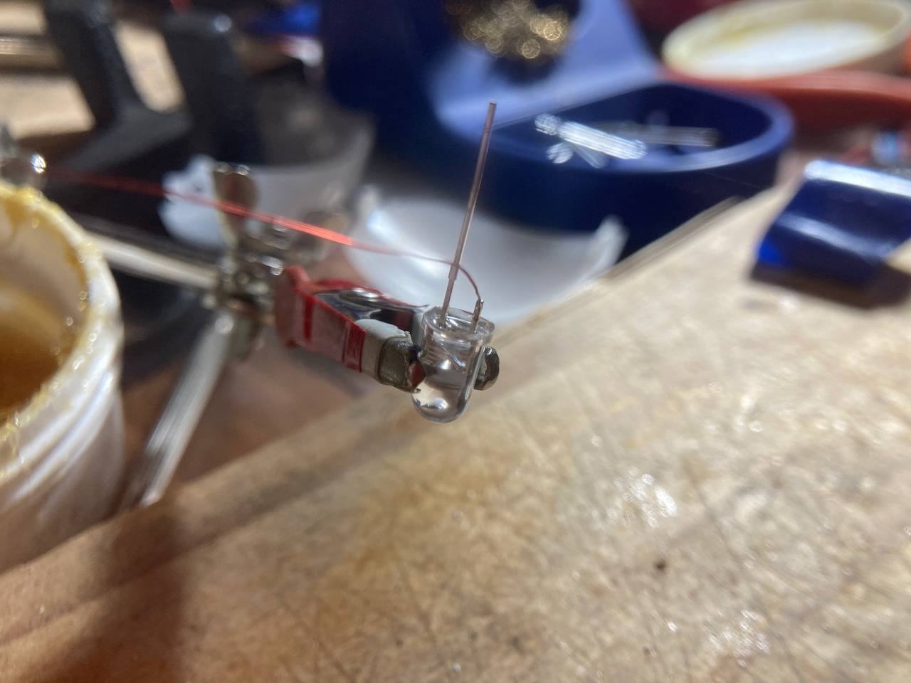
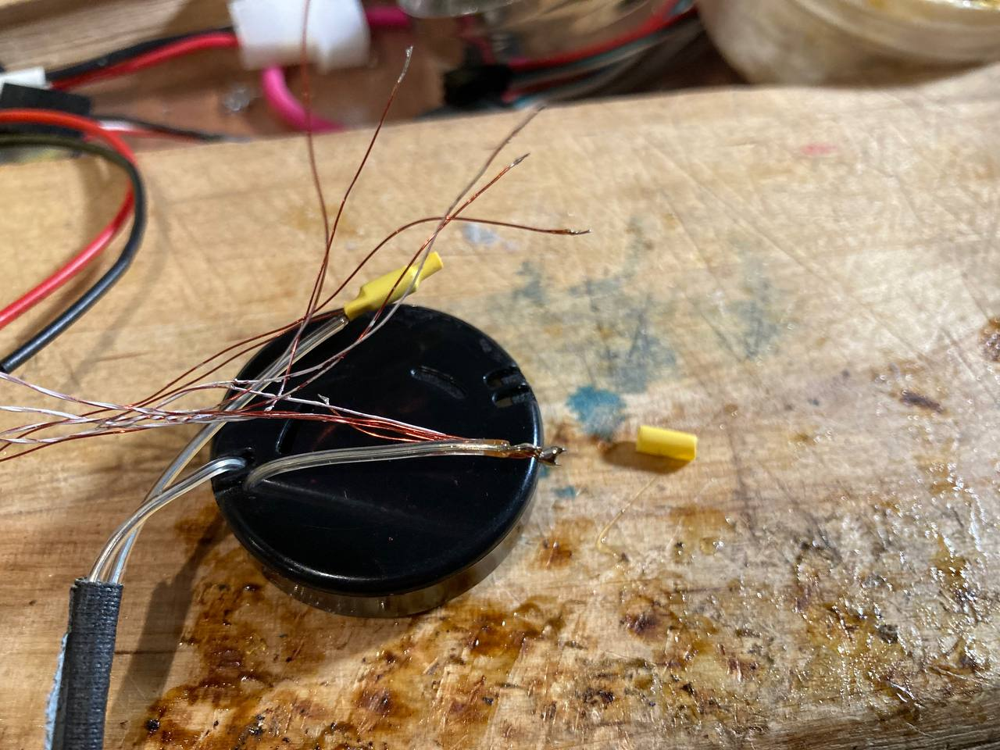
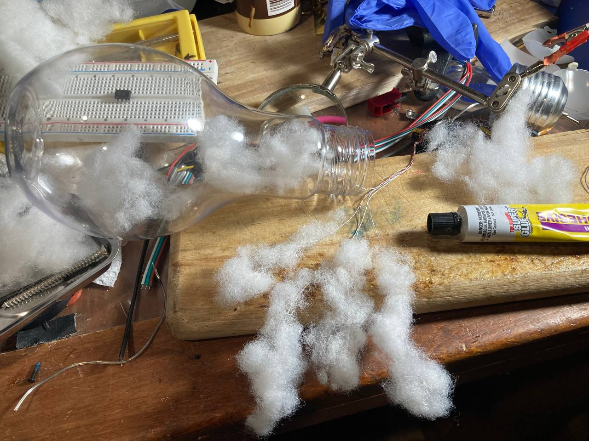
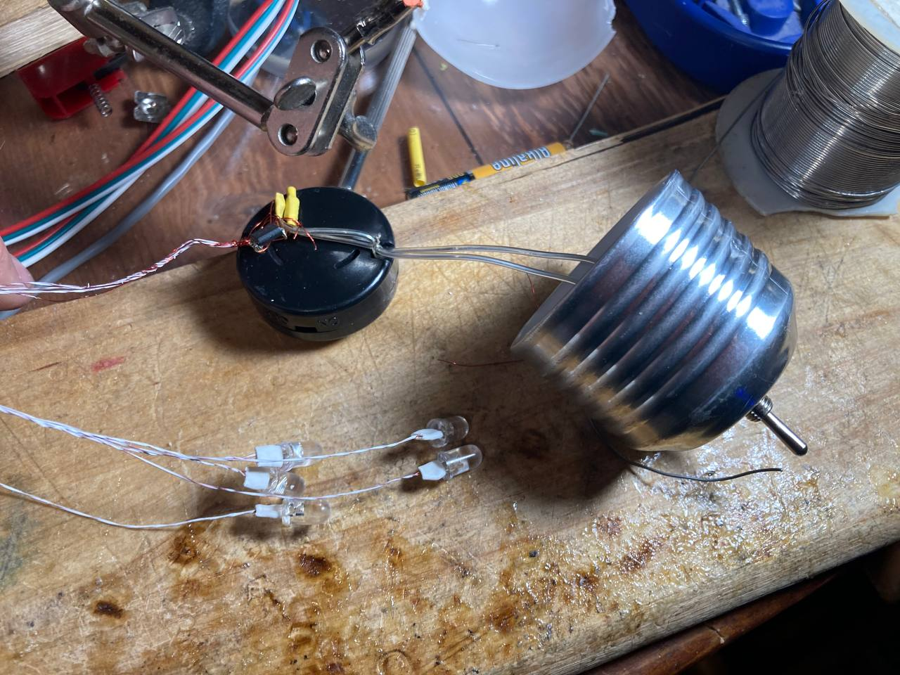

# A Christmas Tree Ornament containing clouds with lightning strikes
Code for a Christmas Tree Ornament containing clouds with lightning strikes, for Arduino and AtTiny controllers.

 

[Download VIDEO1.MOV (day)](https://github.com/sonyhome/lightning_ornament/raw/refs/heads/main/README_DATA/VIDEO1.MOV)

[Download VIDEO2.MOV (night)](https://github.com/sonyhome/lightning_ornament/raw/refs/heads/main/README_DATA/VIDEO2.MOV)

## Code overview

The code defines a main lightning strike and secondary "ripple" lightning in the ***thunder*** global variable structre. There is a long delay for the main lightning, and shorter delays for the ripples (min and max timings are in msecs). These delays are random, picked between the hard-coded min and the max values.

<details>

<summary>thunder definition</summary>
The first 3 ***Runtime*** values are set by the code during runtime to keep track of the lightning strike state. The ***const*** are presets for the lightning strike timings.

```C++
// Define a thunder effect: First "long" lightning and "short" ripples
typedef struct delays {
  unsigned long longTimeStamp;   // Runtime value (ms)
  unsigned long shortTimeStamp;  // Runtime value (ms)
  uint8_t shortStrikeCount;      // Runtime value (ms)
  const unsigned long longMax;   // Max wait between strikes (ms)
  const unsigned long longMin;  // Maxwait between ripples (ms)
  const unsigned long shortMax;  // Maxwait between ripples (ms)
  const unsigned long shortMin;  // Maxwait between ripples (ms)
} delays_t;

// Specify the thunder timing values
delays_t thunder = { 0, 0, 0, 10000, 2000, 200, 1};
```
</details>

Each LED is attached to a pin of the controller. The set of pins are defined the the ***led_pin*** global constant array. The number of LEDs in the circuit is defined by the ***numLeds*** constant.

Arduino vs AtTiny compilation is controlled by the ***IS_ATTINY85_CONTROLLER*** macro.

To compile for AtTiny controllers make sure this is not commented out:
```C
#define IS_ATTINY85_CONTROLLER
```
The code that will be active to configure the AtTiny controller will be between these two lines:
```C
#ifdef IS_ATTINY85_CONTROLLER
 ...
#else
```
To compile for any other Arduino controller, just comment that line.
```C
//#define IS_ATTINY85_CONTROLLER
```
The code that will be active to configure the Arduino controller will be between these two lines:
```C
#else
 ...
#endif
```
Mostly, that section of code allows Arduino boards to use the Serial debug output, and define which port the LEDs are connected to.

You will notice a section for AtTiny controllers in the ***setup()*** function. The main purpose of it is to disable unused hardware in the controller to minimise power consumption. It will be between inside that function:
```C
#ifdef IS_ATTINY85_CONTROLLER
 ...
#endif
```

The ***setup()*** function otherwise just configures the pins used for LEDs as output I/O so the controller can flip the power from ground to Vcc.

The ***loop()*** function keeps track of time with ***millis()***. At every loop it reads the current time with it and compares it to the time it saved for the lightning events. If the time elapsed is past the recorded time to trigger an event, it handles that event. The event happens by calling ***lightning()*** or ***lightningRipple()***. After that it sets up the next events.
A main lightning will trigger configuration of the ripple lightning: how many and when is the first one to happen.
A lightning ripple will count down the number of ripples, and set when is the next one to happen.

To reduce the number of times ***loop()*** iterates, ***loopDelay*** is set and ***sleep_delay(loopDelay);*** is called.

ideally ***sleep_delay()*** should be replaced with something that puts the chip in deep sleep to minimize power consumption more, but it might require setting up an external low power clock to trigger an interupt, or maybe __timer1__ could be used, but that's beyond the scope of the current version.

## Picking LED ports
You can select how many LEDs you want and on which port to attach them by changing the ***led_pin*** and ***numLeds*** constants.

<details>
<summary>Finding the pin numbers you want to use</summary>
To figure that out if you don't know yet, google the name of your board or controller and "pinout". There will be many things listed, for example:


Ignore all the info that's not just a number, and ignore the numbers on the chip's pins. Pins are usually numbered from top left (next to the chip's ***o*** mark), down, down right to top right. That's just to find a chip's physical pin on the board, and has nothing to do with the logical pinout.
There's pins marked PB1 or PD1, these indicate the purpose of the pin, aka bit 1 or port B or D. AtTiny85 only has port B. Other infos tell you which interrupt it is attached to or if it's used for analog A/D conversion, or part of a protocol like Serial or SPI (which means internally it's connected to a little bit of extra hardware tha can optionally be enabled for that purpose).

What you want: In blue on this diagram, there's pure numbers. Note that some diagrams may be missing them, if so look for another one. This is the number the Arduino infrastructure knows that pin as, and it can be used to reference it with ***digitalWrite()*** or ***digitalRead()*** functions.  If you have no luck with that, at minimum you should know how many ports the chip has (for example ports A, B, D...). Each port is usually 8 bits, so you could pick a number like 0, and test the pin connected to bit 0 of each port to find out which port uses pins 0~7, and so on, to do your own mapping manually.

Those numbers are also just printed on the Arduino boards like the Arduino Uno, as shown below on the top of the board where there's __"Digital"__ written, so that's easy.

</details>

## Programming an AtTiny controller

To use this code on a bare AtTiny controller, you need a chip programmer.

<details>
This can be done with an Arduino Uno (there is a sketch example "ArduinoISP" to load, and a how-to to follow). To program the chip you must do two things:
* configure the controller type and frequency with ***Tools/Boards/attiny/AtTiny25/45/85*** (I use AtTiny85 at 1MHz internal clock for this), and run ***Tools/Burn Bootloader***
* install the program on the controller, using ***Sketch/Upload Using Programmer***. For that you must set first the programmer: ***Tools/Programmer/Arduino As ISP***
If you don't have yet ***attiny*** in your board selection, you need to fetch it in the library with ***Tools/Boards/Board Manager***.
</details>

Alternatively don't bother and use any Arduino board, or an AtTiny mini-board with a USB port, pre installed with a bootloader. It will also be much easier to wire or solder together.

## The build

The build diagram is in the comments of the source code

The AtTiny85 can be powered with a wide range of voltages up to 5.5V. The LEDs can be fed pretty much anything over 3V. We are OK to overdrive them, as long as the flashes are very brief (less than 3 or 4 millisecond), and are spaced out far enough to allow heat to dissipate (seconds).

### Using one CR2032 batteries

It can function with one CR2032 battery at 2.8~3.3V, which is enough to also power the LEDs, making the circuit minimal. It's only a battery holder, LEDs and an AtTiny chip.

### Using two CR2032 batteries

In the build below, I use two CR2032 batteries (Vcc peaks at 6.6V). The AtTiny85 max Vdd is 5.5V (some documents indicate it can tolerate 6V). Hence I put on the battery + lead a diode to drop the voltage 1V to around 5.6V.

One battery works, but the reasoning of using 2 batteries is as follows:

* At least twice the runtime (one battery lasts a week)
* Brighter (we significantly overdrive the LEDs at 5V past their spec)
* CR2032 are depleted at 2.7V (aka 5.4V) which is above the LED turn on threshold so they will light up longer close to the battery depletion state.

<detail>
<summary>A note on battery depletion</summary>

A battery has a voltage and an internal resistance that change with time, which affects how much current can come out.

A CR2032 battery starts at 3.4V and 10Ohm internal resistance. Near its end of life it reaches 2.8V and 50Ohm resistance, and is considered dead at 2.7V, with nearly 400Ohm resistance (meaning max 7mA can be pulled out).

With 400 Ohm of resistance, even adding a volt of battery power would not make the LED significantly brighter longer it seems (not tested though), but if it did look at the clamping voltage note below. This has implications on how I add a diode to reduce the max voltage to protect the controller.

For full brightness an LED needs about 30mA ofcurrent, and 3V.

You can model the equivalent circuit as:

```
Vcc --[Resistor]--[LED]-- Ground
```
Vcc - Vled = R * i

The V=f(i) graph of the LED is not available but is exponential so we can hand-wave it, as on is > 3.5V for example:

With fresh batteries: i = (5.5V - 3.5V)/10Ohm =200mA

we overdrive the LED 10x past it's normal operation point of 30mA. If we were to keep the blink too long it would overheat and burn out quickly.

With dead batteries: i = (4.5V - 3.5V)/400Ohm = 2.5mA

the LED would barely light up. Note that this is likely wrong; to know the exact voltage and current we need the LED graph. The LED voltage would likely drop to 2V or 3V for a higher current closer to 6mA. Still dim...
</detail>

### Clamping of output pins

<details>
To overdrive the LEDs while keeping the max voltage of the AtTiny85 under 5.5V, I had the idea of putting diodes on the Vdd or Gnd pin of the controller alone, feeding the LEDS the full brunt of the battery to suck out every last usable mAH.

Any of these configurations for the controller's power pins:
```
Vcc --->| ---[Attiny85]-------- Gnd
Vcc --->| ---[Attiny85]--->|--- Gnd
Vcc ---------[Attiny85]--->|--- Gnd
```
The AVR chips have anti-static (ESD) ***clamping*** zenner diodes on the output pins going both to Vcc and Gnd. The spec specify that the I/O pin will be ***clamped between -0.5V and Vdd+0.5V***. This means that if the voltage is out of that range on the output diode, a current would flow directly to Vdd or Gnd pins from the I/O pin via the clamping Zenner diodes.

In other words, when the LED is turned off there is a risk a current would still flow, turning the LED dimly on, and draining the battery fast.

In my opinion, you could probably get away with one diode on each side like the diagram above, because there is a 0.5V histeresis, meaning a current drain to adjust the LED voltage between 0 and 0.4V. Because an LED is a diode, the graph is exponential so to achieve the voltage, the current would likely be very small as this voltage is far below the LED turn on voltage.

This is not tested since I think the battery internal resistance overshadows gaining 0.5V~1V on the LED. Maybe I'm wrong? The current design puts the diode on the power bank, so the whole circuit's voltage is dropped for the controller AND the LEDs, instead of just for the controller.
</details>

### Overdriving the AtTiny85 I/O pins

<details>
The math indicates with fresh batteries up to 200mA can flow through the I/O pin and the LED.

There is a concern that the controller's internal might not handle such high current surges. If that's the case it is expected that the surge would be better supported when going towards the drain (ground) than from the power rail (Vcc), as there might be fewer logical components along the way.

If that's the case we could modify the controller's I/O to gate the ground, so that the LED is turned off when the output pin is high, and on when the output pin is grounded. That's a minimal change on the source code...

Note this has implications on where a diode could be put on the pins of the controller (see clamping section).
</details>

## Soldering the project

The project took me about 2 hours to put together

Materials
* One transparent christmas ornament or other container
* One battery holder (one or two CR2032 batteries for me but anything between 3V and 5.5V is OK)
* One diode (to drop the battery voltage closer to 5.5V)
* 5 white LEDs
* 1 AtTiny85
* Thin magnet wire (any wire is OK, white or thin is better)
* 1 8-pin chip holder optional (so you can remove the AtTiny to reprogram it). I just soldered on the pins of mine
* cotton ball
* glue
* power switch optional
* heat shrink tubing

You'll need a good soldering iron, solder and flux (very important IMHO to use flux).

Cut the LED pins short and solder wires on them. The long pin goes to (+), aka the controller's I/O pin, and (-) to the ground. Test that the LEDs turn on by putting power on them (a single CR2032 battery works)


Collect all the ground wires of the LEDs, plus one for the controller into a bunch soldered to the (-) lead of the battery pack. Test it still works, and then solder the LEDs to the controller pins carefully.

I personally like to  make sure the connection is a bit away from fragile elements, wires twisted gently then soldered well, then heat shrink wrapped.



Glue some cotton on the LEDs and wires to obfuscate them.



Eventually you have everything connected together, be gentle. Especially with the controller solder. I like to anchor the wires so they don't tug on electronics when they move.I found small holes on my battery holder that I used for makeshift mini zip-ties.



Assemble the thing you did!

